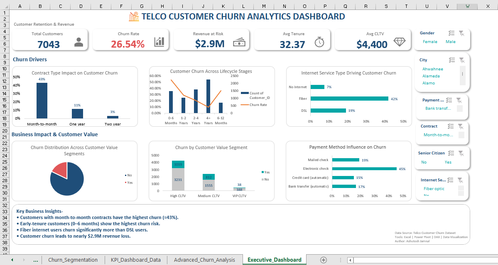

# Telco Customer Churn Analysis (Excel Dashboard)

## Project Overview

Customer churn is a major challenge for telecom companies because losing existing customers directly impacts revenue and increases acquisition costs.

In this project, I analyzed a telecom customer dataset to understand **why customers churn, which segments are most at risk, and how much revenue the company could potentially lose**.

Using **Microsoft Excel, Power Pivot, and DAX**, I built an **interactive executive dashboard** that highlights churn drivers, customer lifecycle behavior, and revenue impact.

---

## Problem Statement

Telecom companies often struggle to identify **which customers are likely to churn and what factors drive that decision**.

The objective of this project was to:

* Identify **key drivers of customer churn**
* Understand **customer behavior across lifecycle stages**
* Measure the **financial impact of churn**
* Build a **dashboard that supports business decision-making**

---

## Dataset

* Dataset: Telco Customer Churn Dataset
* Total Customers Analyzed: **7,043**

The dataset includes information such as:

* Customer tenure
* Contract type
* Internet service
* Payment method
* Monthly charges
* Customer lifetime value (CLTV)

---

## Tools & Techniques

* Microsoft Excel
* Power Pivot
* DAX Measures
* Pivot Tables
* Descriptive Statistics
* Correlation Analysis
* Customer Segmentation
* Interactive Dashboard Design

---

## Business Impact

This analysis helps business stakeholders understand where churn is happening and which customers require retention strategies.

Key outcomes from the analysis:

* **26.5% overall churn rate**, which is above the telecom industry benchmark (~20%).
* Customers who churned contributed to approximately **$2.9M in revenue at risk**.
* Identifying high-risk segments allows businesses to **target retention campaigns and reduce revenue loss**.

---

## Key Insights

**1. Contract Type Drives Churn**

* Customers on **month-to-month contracts show ~43% churn**, significantly higher than longer contract plans.

**2. Early Customer Lifecycle Risk**

* Customers in their **first 6 months have ~53% churn probability**, making onboarding experience critical.

**3. Internet Service Impact**

* **Fiber optic users churn around 41–42%**, which is much higher than DSL customers.

**4. Payment Behavior**

* Customers paying via **electronic check show the highest churn rates**, suggesting billing friction or pricing concerns.

**5. Customer Value Risk**

* A significant portion of churn comes from **medium and high CLTV segments**, indicating potential long-term revenue loss.

---

## Dashboard Features

The executive dashboard provides:

* KPI overview of churn metrics
* Churn analysis by contract type, tenure, and service type
* Customer value segmentation
* Revenue at risk analysis
* Interactive slicers for customer segmentation

The dashboard allows stakeholders to **quickly identify churn patterns and explore customer segments dynamically**.

---

## Dashboard Preview

---

## Author

**Ashutosh Jamnal**
